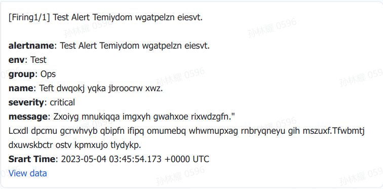

### Alert
```json
[
  {
    "labels": {
      "alertname": "Test Alert Temiydom wgatpelzn eiesvt.",
      "env": "Test",
      "group": "Ops",
      "name": "Teft dwqokj yqka jbroocrw xwz.",
      "severity": "critical"
    },
    "annotations": {
      "message": "Zxoiyg mnukiqqa imgxyh gwahxoe rixwdzgfn.\"\nLcxdl dpcmu gcrwhvyb qbipfn ifipq omumebq whwmupxag rnbryqneyu gih mszuxf.Tfwbmtj dxuwskbctr ostv kpmxujo tlydykp."
    },
    "startsAt": "2023-05-04T03:45:54.173Z",
    "endsAt": "2023-05-04T04:45:54.173Z",
    "generatorURL": "https://www.github.com"
  }
]
```
### Template 
```gotemplate
{{- define "feishu.title" -}}
    {{- if eq .Status "firing" -}}
        [Firing {{- .Alerts.Firing | len -}}/{{- .Alerts | len -}}]
    {{- else if eq .Status "resolved" -}}
        [Resolved {{- .Alerts.Resolved | len -}}]
    {{- else -}}
        [{{- .Status | toUpper | safeJson -}}]
    {{- end -}}
    {{" "}}{{- range .GroupLabels.SortedPairs -}} {{- if eq .Name "alertname" -}}{{- .Value | safeJson -}}{{- end -}} {{- end -}}
{{- end -}}

{{- define "feishu.msg" -}}
    ### {{ template "feishu.title" . -}}\n
    {{- range $idx,$elem := .Alerts.Firing -}}
        {{- range .Labels.SortedPairs -}}
            **{{- .Name | safeJson -}}**:{{" "}}{{- .Value | safeJson -}}\n
        {{- end -}}
        {{- range .Annotations.SortedPairs -}}
            **{{- .Name | safeJson -}}**:{{" "}}{{- .Value | safeJson -}}\n
        {{- end -}}
        **Srart Time**:{{" "}}{{- .StartsAt -}}\n
        {{- if eq .Status "firing" -}}
            [View data]({{.GeneratorURL | safeJson}})
        {{- end -}}
    {{- end -}}
{{- end -}}
{{- define "feishu.json" -}}
    {
        "msg_type": "interactive",
        "card": {
            "elements": [
                {
                    "content": "{{- template "feishu.msg" . -}}",
                    "tag": "markdown"
                }
            ],
            "config": {
                "wide_screen_mode": true
            }
        }
    }
{{- end -}}

```
### Alertmanager Config
```yaml
receivers:
  - name: "web.hook"
    webhook_configs:
      - url: 'https://open.feishu.cn/open-apis/bot/v2/hook/xxxxxxxxxxxxx'
        json: '{{ template "feishu.json" . }}'
        send_resolved: true
```

### Webhook Content
```
{
    "msg_type": "interactive",
    "card": {
        "elements": [
            {
                "content": "### [Firing1/1] Test Alert Temiydom wgatpelzn eiesvt.\n**alertname**: Test Alert Temiydom wgatpelzn eiesvt.\n**env**: Test\n**group**: Ops\n**name**: Teft dwqokj yqka jbroocrw xwz.\n**severity**: critical\n**message**: Zxoiyg mnukiqqa imgxyh gwahxoe rixwdzgfn.\"\nLcxdl dpcmu gcrwhvyb qbipfn ifipq omumebq whwmupxag rnbryqneyu gih mszuxf.Tfwbmtj dxuwskbctr ostv kpmxujo tlydykp.\n**Srart Time**: 2023-05-04 03:45:54.173 +0000 UTC\n[View data](https://www.github.com)",
                "tag": "markdown"
            }
        ],
        "config": {
            "wide_screen_mode": true
        }
    }
}
```

### Feishu message
