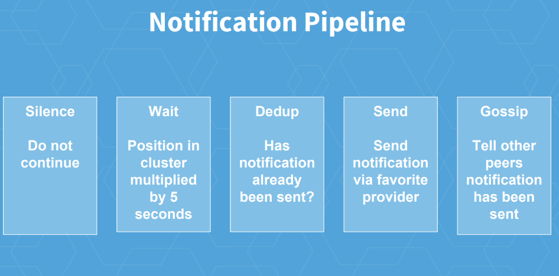
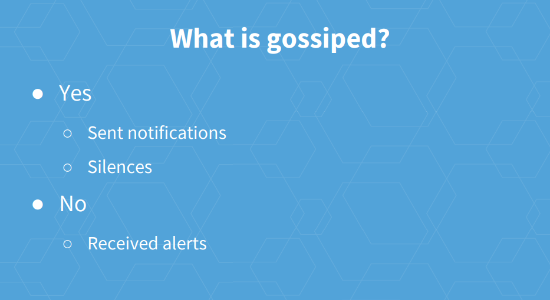

# cluster.reconnect
* alertmanager->cluster.go -> Peer.reconnect
  * memeberlist -> memberlist.go -> MemberList.Join -> MemberList.pushPullNode.
* How alertmanager send nf log data to remote node?
  * where is nf log data?
* How alertmanager use nf log?
  * In DedupStage.Exec, it will query nf log.
* What is nf log?
  * Where intialization of nflog
    * main.go: notificationLog, err := nflog.New(notificationLogOpts...)
  * It will persist to file: storage.path/nflog
  * what's the format? Protocol Buffer: nflog/nflogpb/nflog.proto
* factors that impacts if needs send alert to receiver:
  * See below notification pipeline.
* how alert manager tell other peers notification has been sent?
  * The facility for gossiping notification log:
    * main.go -> run -> c := peer.AddState("nfl", notificationLog, prometheus.DefaultRegisterer)
      * It will return ClusterChannel to which alertmanager can send notification to peers.
      * It was followed by call: notificationLog.SetBroadcast(c.Broadcast)
        * So nflog will use Channel's c.Broadcast to send notification record to peers.
* Where to call the receiver?
  * notify.go -> RetryStage.exec -> r.integration.Notify(ctx, sent...)
* task: to log the nofitication gossip?
  * nflog -> Merge: level.Debug(l.logger).Log("msg", "gossiping new entry", "entry", e)
* Who will trigger the pipeline?
  * Dispatcher
  * main.go: disp = dispatch.NewDispatcher(alerts, routes, pipeline, marker, timeoutFunc, nil, logger, dispMetrics)
  * dispatcher -> Run -> run -> processAlert -> stage.Exec
* How do these stages construct the pipeline?
  * MultiStage + FanoutStage.
    * MultiStage will run Stage one by one.
    * FanoutStage will run Stages concurrently.
* How Dedup stage take effect?
  * TODO
* References
  * https://promcon.io/2017-munich/slides/alertmanager-and-high-availability.pdf
  * 
  * 